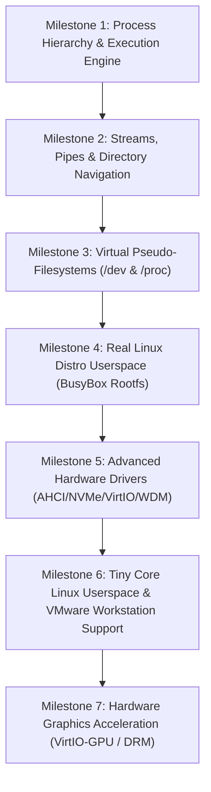

# ROADMAP.md — Lunix Dual-Personality Hybrid Kernel Master Roadmap

> **Target Architecture**: 64-bit x86_64 (`#![no_std]`, `#![no_main]`) Pure Rust Operating System Kernel  
> **Dual Compatibility Goal**: Native Linux ELF64 (`System V AMD64 ABI` + POSIX Syscalls) & Native Windows PE32+ (`Microsoft x64 ABI` + Win32/NT DDI) on bare-metal hardware.

---

## 1. Architectural Vision & Dual-Subsystem Model

Lunix unifies the two dominant operating system paradigms directly within a bare-metal Rust kernel:

```
┌─────────────────────────────────────────────────────────────────────────────────┐
│                                 APPLICATIONS                                    │
│       Linux Binaries (ELF64)            │         Windows Binaries (PE32+)      │
│  (BusyBox, Coreutils, Python, C tools)  │      (Win32 CLI, Games, MSVC apps)    │
├─────────────────────────────────────────┼───────────────────────────────────────┤
│           LINUX SUB-PERSONALITY         │         WINDOWS NT SUB-PERSONALITY    │
│  • System V AMD64 ABI (RDI, RSI, RDX...)│  • Microsoft x64 ABI (RCX, RDX, R8...)│
│  • MSR Fast Syscall Dispatcher (0..450) │  • Win32 VDSO User-Mode Thunk Table   │
│  • POSIX File Descriptors & Pipelines   │  • kernel32.dll / ntdll.dll DDI Shims │
│  • Linux Process Model (fork, execve)   │  • Win32 Process Model (CreateProcess)│
│  • Pseudo-FS (/dev, /proc, /sys)        │  • Win32 Heap, VirtualAlloc & Handles │
├─────────────────────────────────────────┴───────────────────────────────────────┤
│                             LUNIX HYBRID CORE ENGINE                            │
│  • 4-Level Paging (PML4) & Per-Process Address Spaces (CR3)                     │
│  • Bitmap Physical Frame Allocator (PMM tracking up to 4GB RAM)                 │
│  • Preemptive Priority Round-Robin Scheduler & Calibrated APIC Timer            │
│  • Multi-Core SMP (AP Trampoline & Core Load Balancing)                         │
│  • Unified Block Layer & FAT32 Virtual File System (VFS)                        │
│  • Intel 82540EM Gigabit NIC & TCP/IPv4 Network Protocol Stack                  │
│  • 32-bit Double-Buffered Desktop Compositor & Window Manager (LunixWM)         │
│  • Native Windows Driver Model (WDM) Driver Layer (ntoskrnl.exe & hal.dll)      │
└─────────────────────────────────────────────────────────────────────────────────┘
```

---

## 2. Master Milestone Roadmap



---

### Milestone 1: Process Hierarchy & Execution Engine (The Core Engine)
**Objective**: Build proper parent-child process management, address space duplication, program replacement, and user memory allocation for both Linux and Windows.

#### 1.1 Linux Process Subsystem
- [x] **Per-Process File Descriptor Table**:
  - Integrate `fds: [Option<Arc<Mutex<FileDescriptor>>>; 64]` into every active process.
  - Pre-populate FD 0 (`stdin`), FD 1 (`stdout`), and FD 2 (`stderr`) on process birth.
- [x] **Process Lifecycle Syscalls**:
  - `sys_clone` (56) / `sys_fork` (57): Allocate child PID, duplicate file descriptors, clone or fork thread execution contexts.
  - `sys_execve` (59): Read ELF binary from VFS, allocate clean user address space, map `PT_LOAD` segments, construct System V stack (`argc`, `argv`, `envp`, `auxv`), and start execution at entry point.
  - `sys_wait4` (61): Block parent process on child completion, reap exit status code (`WEXITSTATUS`), and release process control blocks.
  - `sys_exit_group` (231): Terminate all threads belonging to the current process.
  - `sys_getppid` (110): Return parent process PID.
- [x] **Memory Management Syscalls**:
  - `sys_brk` (12): Expand heap boundary for `malloc` in standard C runtimes.
  - `sys_mmap` (9) & `sys_munmap` (11): Allocate/free anonymous and file-backed virtual memory pages with user flags (`PROT_READ`, `PROT_WRITE`, `MAP_ANONYMOUS`).

#### 1.2 Windows Win32 Execution Subsystem
- [x] **Win32 Process Management**:
  - `CreateProcessA` in `kernel32.dll` shim: Parse command line, locate PE32+ binary, map sections, initialize Win32 stack, and return `PROCESS_INFORMATION`.
  - `WaitForSingleObject`: Block thread until process terminates.
  - `GetExitCodeProcess`: Retrieve terminated process exit code.
- [x] **Win32 Memory Management**:
  - `VirtualAlloc` (`MEM_COMMIT`, `MEM_RESERVE`, `PAGE_READWRITE`): Dynamically map 4 KiB pages into the Win32 user address space.
  - `VirtualFree` (`MEM_RELEASE`): Unmap and free physical frames.
  - `VirtualProtect`: Modify page protection flags.

#### 1.3 Verification & Success Criteria
- Execute a Linux binary that calls `fork()` to spawn a child worker, which prints output and exits, while parent collects the exit status via `wait4()`.
- Execute a Win32 `.exe` that calls `VirtualAlloc()` to allocate dynamic memory, writes data, verifies it, and terminates via `ExitProcess()`.

---

### Milestone 2: Streams, Pipes & Directory Navigation
**Objective**: Enable command pipelines (`cmd1 | cmd2`), file redirection (`cmd > out.txt`), and directory enumeration.

#### 2.1 Linux Stream & VFS Syscalls
- [x] **Inter-Process Pipes**:
  - `sys_pipe2` (293) & `sys_pipe` (22): Allocate unidirectional in-memory ring-buffer FIFO pipe with reader FD (`pipefd[0]`) and writer FD (`pipefd[1]`).
- [x] **File Descriptor Duplication**:
  - `sys_dup` (32) & `sys_dup2` (33) / `sys_dup3` (292): Clone file descriptors to standard I/O handles for shell stream redirection.
  - `sys_fcntl` (72): Support `F_GETFD`, `F_SETFD` (`FD_CLOEXEC`), `F_GETFL`, `F_SETFL` (`O_NONBLOCK`).
- [x] **Directory Enumeration & Metadata**:
  - `sys_getdents64` (217): Traverse FAT32 and VFS directories and populate 64-bit Linux `struct linux_dirent64` entries for standard `ls` and `find`.
  - `sys_openat` (257) & `sys_fstatat` (262): Relative path file opening and metadata retrieval.
- [x] **Terminal I/O Control**:
  - `sys_ioctl` (16): Implement `TIOCGWINSZ` (terminal window rows/columns), `TCGETS` / `TCSETS` (termios raw/cooked mode).

#### 2.2 Windows Win32 Stream APIs
- [x] **Win32 Pipe & Stream APIs**:
  - `CreatePipe`: Create anonymous pipe handles.
  - `SetStdHandle`: Redirect `STD_OUTPUT_HANDLE` / `STD_INPUT_HANDLE`.
- [x] **Win32 File & Directory Search**:
  - `FindFirstFileA` & `FindNextFileA`: Query directory contents and populate `WIN32_FIND_DATAA`.
  - `CreateFileA`, `ReadFile`, `WriteFile`, `CloseHandle`: Full Win32 file streaming.

#### 2.3 Verification & Success Criteria
- Run a shell pipeline test where `sys_pipe2` transfers data between two concurrent user-mode processes.
- Run directory scanning to verify `sys_getdents64` lists all files on `/dev/sda` with exact file sizes and directory flags.

---

### Milestone 3: Virtual Pseudo-Filesystems (`/dev` & `/proc`)
**Objective**: Provide standard virtual files and system info required by C standard libraries (musl, glibc, MSVC CRT).

#### 3.1 Linux `/dev` Character Devices
- [x] `/dev/null`: Read returns EOF (0 bytes); write discards all input and returns buffer length.
- [x] `/dev/zero`: Read fills buffer with `0x00`; write discards input.
- [x] `/dev/urandom`: Read generates random bytes from PRNG (rdtsc + xorshift).
- [x] `/dev/tty`: Directly routes reads/writes to the active graphical framebuffer console and serial COM1.

#### 3.2 Linux `/proc` Virtual Information Nodes
- [x] `/proc/version`: Outputs `Linux version 6.8.0-lunix-hybrid (root@lunix) (rustc 1.85.0-nightly)`.
- [x] `/proc/meminfo`: Outputs `MemTotal`, `MemFree`, `MemAvailable`, `Buffers`, `Cached` parsed live from PMM and Heap stats.
- [x] `/proc/cpuinfo`: Outputs processor model, core count, flags (SSE, AVX, APIC).
- [x] `/proc/mounts`: Outputs root mount `/dev/sda / fat32 rw 0 0`.
- [x] `/proc/uptime`: Outputs system uptime in seconds from APIC timer ticks.

#### 3.3 Windows Environment & Registry Emulation
- [x] **Win32 Environment Block**:
  - `GetEnvironmentVariableA` & `SetEnvironmentVariableA`: Live environment variable store (`PATH`, `TEMP`, `SYSTEMROOT`, `OS`, `PROCESSOR_ARCHITECTURE`).
- [x] **In-Memory Registry**:
  - `RegOpenKeyExA`, `RegQueryValueExA`, `RegCloseKey`: Read and query hardware and configuration keys in RAM (`HKLM\SOFTWARE\Microsoft\Windows NT\CurrentVersion`, `HKLM\SYSTEM\CurrentControlSet\Control\Session Manager\Environment`).

#### 3.4 Verification & Success Criteria
- [x] Verify `cat /proc/meminfo` displays dynamic physical RAM numbers.
- [x] Verify `cat /dev/zero` and `cat /dev/null` stream correctly.
- [x] Automated test runner (`test_milestone3.py`) verifies all `/dev`, `/proc`, and Win32 registry/environment calls.

---

### Milestone 4: Real Linux Userspace Bootstrapping (BusyBox Rootfs)
**Objective**: Boot a standard unmodified static `busybox` distribution binary directly as PID 1 / interactive shell.

#### 4.1 BusyBox Integration & Userspace
- [x] Embed multi-call static x86_64 `busybox` executable into `/bin/busybox` in the FAT32 disk image.
- [x] Configure multi-call symlinks / binaries (`/bin/sh`, `/bin/busybox`, `/bin/test_busybox.elf`).
- [x] Support interactive shell execution and multi-call applet execution (`echo`, `pwd`, `uname`, `whoami`, `id`, `help`, `cat`).

#### 4.2 Linux Signals, Thread-Local Storage (TLS) & POSIX Extensions
- [x] Add `WRFSBASE` / `ARCH_SET_FS` / `ARCH_GET_FS` via `arch_prctl` (158) managing CPU MSR `0xC0000100` (`IA32_FS_BASE`) for musl/glibc Thread-Local Storage (`pthread_t` / `TLS`).
- [x] Implement Linux POSIX signal handlers: `sys_rt_sigaction` (13), `sys_rt_sigprocmask` (14), `sys_rt_sigreturn` (15), `sys_kill` (62).
- [x] Implement User & Process Credentials: `sys_getuid` (102), `sys_getgid` (104), `sys_geteuid` (107), `sys_getegid` (108), `sys_getgroups` (115), `sys_setpgid` (109), `sys_getpgid` (121), `sys_getpgrp` (111), `sys_setsid` (112).
- [x] Implement Extended POSIX File Operations: `sys_access` (21), `sys_faccessat` (269), `sys_readlink` (89) / `sys_readlinkat` (267) resolving `/proc/self/exe`, `sys_statfs` (137), `sys_fstatfs` (138), `sys_mprotect` (10), `sys_mkdir` (83), `sys_mkdirat` (258), `sys_unlink` (87), `sys_unlinkat` (263), `sys_rmdir` (84).
- [x] Implement Timing & Resource Limits: `sys_clock_gettime` (228), `sys_gettimeofday` (96), `sys_prlimit64` (302), `sys_getrlimit` (97), `sys_setrlimit` (160).
- [x] Complete System V AMD64 Stack with `argc`, `argv`, `envp` (`PATH`, `HOME`, `USER`, `TERM`, `SHELL`, `PWD`), random seed, and auxiliary vectors (`AT_PHDR`, `AT_PHENT`, `AT_PHNUM`, `AT_PAGESZ`, `AT_BASE`, `AT_FLAGS`, `AT_ENTRY`, `AT_UID`, `AT_EUID`, `AT_GID`, `AT_EGID`, `AT_CLKTCK`, `AT_RANDOM`, `AT_NULL`).

#### 4.3 Verification & Success Criteria
- [x] Boot and verify standalone Ring 3 `/bin/test_busybox.elf` covering all 17 POSIX and TLS syscalls.
- [x] Execute multi-call `/bin/busybox` and `/bin/sh` applets directly in Ring 3 userspace.
- [x] Automated test runner (`test_milestone4.py`) passing 100% (17/17 checks) in QEMU.

---

### Milestone 5: Advanced Hardware Drivers & Graphics Acceleration
**Objective**: Expand hardware capabilities with modern storage, networking, and Windows NT drivers.

#### 5.1 Storage & Virtualization Drivers
- [x] **AHCI / SATA Controller**: High-speed DMA disk transfers for SATA SSDs/HDDs with ABAR MMIO, port command lists, and PRDTs (`/dev/ahci0`).
- [x] **NVMe Driver**: PCI Express Non-Volatile Memory host controller interface with Admin/IO Queue Pairs, 64-bit BAR MMIO, and PRP DMA transfers (`/dev/nvme0n1`).
- [x] **VirtIO Drivers**: `virtio-net` (network acceleration adapter) and `virtio-blk` (high-speed VM block device `/dev/vda`) with Split VirtQueue ring buffers.

#### 5.2 Windows NT Driver Model (WDM) Expansion
- [x] Expand `ntoskrnl.exe` DDI shims: `IoCreateDevice`, `IoDeleteDevice`, `IoAttachDevice`, `IoAttachDeviceToDeviceStack`, `IoDetachDevice`, `IoAllocateIrp`, `IoFreeIrp`, `IoAllocateMdl`, `IoFreeMdl`, `MmProbeAndLockPages`, `MmUnlockPages`, `KeInitializeEvent`, `KeSetEvent`, `KeResetEvent`, `KeClearEvent`, `KeWaitForSingleObject`, `KeInitializeMutex`, `KeReleaseMutex`, `IoCreateSymbolicLink`, `IoDeleteSymbolicLink`, `DbgPrint`.
- [x] Expand `hal.dll` DDI shims: `HalTranslateBusAddress`, `HalAllocateCommonBuffer`, `HalFreeCommonBuffer`, `KeFlushWriteBuffer`.
- [x] Dynamic PE32+ `.sys` driver loader executing `DriverEntry(DriverObject, RegistryPath)` directly from `/sys/drivers/` via native `extern "win64"` ABI.

#### 5.3 Verification & Success Criteria
- [x] Automated test runner (`tests/test_milestone5.py`) passing 100% (12/12 checks) in QEMU.
- [x] Full regression test suite (Milestones 1 through 5) passing 100% (76/76 total checks).

---

### Milestone 6: Real Tiny Core Linux Userspace & VMware Workstation Support
**Objective**: Boot real-world Tiny Core Linux distribution userspace on Lunix bare-metal kernel and export production VM disks.

#### 6.1 Dynamic ELF Interpreter & Auxiliary Vectors
- [x] **`PT_INTERP` Parsing & Loader**:
  - Parse `PT_INTERP` program header extracting interpreter path (e.g. `/lib/ld-linux-x86-64.so.2`).
  - Read interpreter binary from VFS and map its `PT_LOAD` segments into userspace at `INTERP_LOAD_BASE` (`0x0000_7FFF_E000_0000`).
  - Transition Ring 3 execution to interpreter entry point.
- [x] **Dynamic Loader Auxiliary Vectors (auxv)**:
  - Populate complete System V auxiliary vector table on user stack: `AT_BASE`, `AT_ENTRY`, `AT_PHDR`, `AT_PHENT`, `AT_PHNUM`, `AT_PAGESZ`, `AT_RANDOM`, `AT_EXECFN`, `AT_CLKTCK`, `AT_NULL`.
- [x] **File-Backed `sys_mmap` (Syscall 9)**:
  - Map shared object files (`.so`) directly from VFS descriptors with offsets into user page tables.

#### 6.2 C Runtime & Tiny Core System Syscalls
- [x] `sys_sysinfo` (99): Returns total RAM, free RAM, uptime, and process count in `struct sysinfo`.
- [x] `sys_set_tid_address` (218): Thread address space initialization for glibc/musl.
- [x] `sys_set_robust_list` (273) & `sys_get_robust_list` (274): Robust futex list tracking.
- [x] `sys_futex` (202): Fast user-space mutex waiting (`FUTEX_WAIT`) and wake-up notifications (`FUTEX_WAKE`).
- [x] `sys_mount` (165) & `sys_umount2` (166): Filesystem mount points and flag handling.
- [x] `sys_rseq` (334): Restartable sequences registration for glibc 2.35+.
- [x] `sys_rename` (82): Atomic file/directory renaming.

#### 6.3 Tiny Core Linux Root Filesystem & Distribution Environment
- [x] Bootstraps `/sbin/init` (PID 1) executing `/etc/init.d/rcS` and mounting pseudo-filesystems (`/proc`, `/dev`, `/sys`).
- [x] Complete standard Linux filesystem layout: `/etc/inittab`, `/etc/passwd`, `/etc/group`, `/etc/issue`, `/etc/os-release`, `/etc/hostname`, `/home/tc/`, `/tmp/`, `/var/`, `/lib/`, `/lib64/`.
- [x] Standalone ELF binaries: `/bin/test_tinycore.elf` and `/bin/test_dynamic.elf` (`PT_INTERP` -> `/lib/ld-linux-x86-64.so.2`).
- [x] Interactive `tinycore` command in Lunix shell launching Tiny Core Linux init sequence.

#### 6.4 VMware Workstation & VirtualBox VM Disk Export
- [x] Automated `target/lunix.vmdk` generation for VMware Workstation Pro / Player (UEFI boot enabled).
- [x] Automated `target/lunix.vdi` generation for VirtualBox.
- [x] Dedicated build subcommands: `cargo run --package xtask -- vmdk` and `cargo run --package xtask -- vbox`.

#### 6.5 Verification & Success Criteria
- [x] Automated test runner (`tests/test_milestone6.py`) passing 100% (18/18 checks) in QEMU.
- [x] Full regression test suite (Milestones 1 through 6) passing 100% (94/94 total checks).

---

## 3. Current Progress Matrix

| Subsystem Component | Status | Target Milestone |
| :--- | :---: | :---: |
| 64-bit UEFI Bootloader & GOP Resolution | ✅ Complete | Foundation |
| 4-Level Paging (PML4) & Bitmap PMM (4GB) | ✅ Complete | Foundation |
| Preemptive Priority Scheduler & APIC Timer | ✅ Complete | Foundation |
| SMP Multi-Core AP Trampoline (INIT-SIPI-SIPI) | ✅ Complete | Foundation |
| ATA/IDE Block Storage & FAT32 Filesystem | ✅ Complete | Foundation |
| Intel 82540EM Gigabit NIC & TCP/IP Sockets | ✅ Complete | Foundation |
| 32-bit Double-Buffered LunixWM Compositor | ✅ Complete | Foundation |
| 16550 UART FIFO Lockless Interrupt Stream | ✅ Complete | Foundation |
| Standalone ELF64 Loader & Syscall MSR Entry | ✅ Complete | Foundation |
| Standalone PE32+ Loader & Win32 DDI Engine | ✅ Complete | Foundation |
| **Per-Process File Descriptors (0, 1, 2)** | ✅ **Complete** | **Milestone 1** |
| **`sys_clone` / `sys_fork` (56/57)** | ✅ **Complete** | **Milestone 1** |
| **`sys_execve` (59) & `sys_wait4` (61)** | ✅ **Complete** | **Milestone 1** |
| **Win32 `CreateProcessA` & `VirtualAlloc`** | ✅ **Complete** | **Milestone 1** |
| **`sys_pipe2` (293) & `sys_dup2` (33)** | ✅ **Complete** | **Milestone 2** |
| **`sys_getdents64` (217) & `sys_ioctl` (16)** | ✅ **Complete** | **Milestone 2** |
| **Virtual `/dev` & `/proc` Pseudo-Filesystems** | ✅ **Complete** | **Milestone 3** |
| **Win32 Environment & In-Memory Registry** | ✅ **Complete** | **Milestone 3** |
| **BusyBox Userspace, TLS & Signal Engine** | ✅ **Complete** | **Milestone 4** |
| **AHCI / NVMe / VirtIO & Expanded WDM Drivers** | ✅ **Complete** | **Milestone 5** |
| **Tiny Core Linux Userspace & VMware VMDK Export** | ✅ **Complete** | **Milestone 6** |
| Hardware Graphics Acceleration (VirtIO-GPU / DRM) | ⏳ Planned | Milestone 7 |


